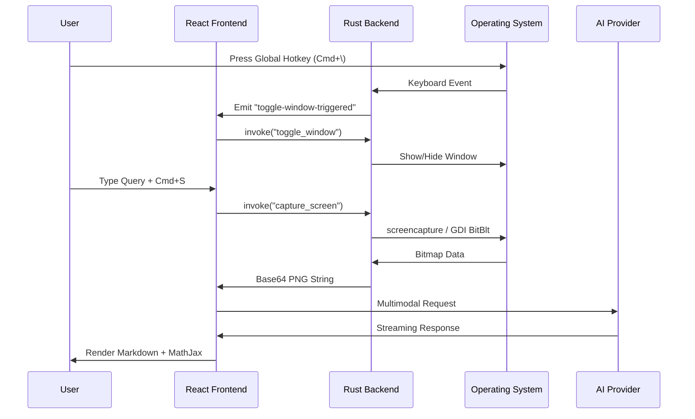

# Lens - Context-Aware AI Desktop Assistant

> **A native, cross-platform desktop overlay that integrates multimodal AI directly into your workflow through global hotkeys, real-time screen capture, and ephemeral chat.**


---

## Table of Contents

- [Executive Summary](#executive-summary)
- [Technical Architecture](#technical-architecture)
- [Core Systems Deep Dive](#core-systems-deep-dive)
  - [Rust Backend](#rust-backend)
  - [TypeScript Frontend](#typescript-frontend)
  - [AI Integration Layer](#ai-integration-layer)
- [Cross-Platform Engineering](#cross-platform-engineering)
- [Performance Optimizations](#performance-optimizations)
- [Security Implementation](#security-implementation)
- [Build System & Deployment](#build-system--deployment)
- [Engineering Accomplishments Summary](#engineering-accomplishments-summary)
- [How to Run](#how-to-run)

---

## Executive Summary

**Lens** is a production-grade desktop AI assistant built with **Tauri 2** (Rust) and **React 19** that solves the context-switching problem developers face when using AI tools. Instead of alt-tabbing to a browser, Lens provides an always-on-top, globally-accessible overlay that can "see" your screen and answer questions in-context.

### Key Engineering Achievements

- **Sub-10MB binary** via Tauri's Rust-based architecture (vs. 150MB+ Electron apps)
- **Cross-platform screen capture** with platform-native APIs (macOS `screencapture`, Windows Win32 GDI)
- **Low-level OS integration** using unsafe Rust FFI to Cocoa (macOS) and Win32 (Windows) APIs
- **Multi-provider AI abstraction** supporting OpenAI GPT-5 Responses API and Google Gemini 2.5 with thinking/reasoning modes
- **Real-time MathJax rendering** with async typeset scheduling to prevent UI blocking
- **Privacy-first design** with content protection APIs to hide the app from screen recordings

---

## Technical Architecture

### High-Level System Design

```
┌─────────────────────────────────────────────────────────────────────────────┐
│                              Lens Desktop App                                │
├─────────────────────────────────────────────────────────────────────────────┤
│  ┌─────────────────────┐     IPC (Tauri Commands)     ┌──────────────────┐  │
│  │   React 19 Frontend │ ◄──────────────────────────► │   Rust Backend   │  │
│  │   (TypeScript/Vite) │                              │   (Tauri 2)      │  │
│  └─────────────────────┘                              └──────────────────┘  │
│           │                                                    │            │
│           ▼                                                    ▼            │
│  ┌─────────────────────┐                              ┌──────────────────┐  │
│  │  AI Service Layer   │                              │  OS Integration  │  │
│  │  - OpenAI SDK       │                              │  - Cocoa FFI     │  │
│  │  - Google GenAI SDK │                              │  - Win32 API     │  │
│  │  - Provider Pattern │                              │  - Global Hotkeys│  │
│  └─────────────────────┘                              └──────────────────┘  │
└─────────────────────────────────────────────────────────────────────────────┘
```

### Message-Passing Architecture

The application uses Tauri's IPC system for communication between the webview and native code:



---

## Core Systems Deep Dive

### Rust Backend

#### Module Structure (`src-tauri/src/`)

```
src/
├── lib.rs              # Application entry, plugin registration, OS setup
├── config.rs           # JSON config persistence (shortcuts)
├── main.rs             # Binary entry point
├── capture/
│   ├── mod.rs          # Platform-conditional compilation
│   ├── macos.rs        # screencapture CLI wrapper
│   └── windows.rs      # Win32 GDI screen capture
└── commands/
    ├── mod.rs          # Command re-exports
    ├── window.rs       # Window toggle, resize, content protection
    └── shortcuts.rs    # Dynamic shortcut registration/unregistration
```

#### OS-Level Window Management (`lib.rs`)

**macOS** - Uses `cocoa` crate for direct Objective-C runtime calls:

```rust
#[cfg(target_os = "macos")]
{
    use cocoa::appkit::{
        NSApplication, NSApplicationActivationPolicy, NSWindow,
        NSWindowCollectionBehavior,
    };
    use cocoa::base::{id, nil};

    unsafe {
        // Hide from Dock and Cmd+Tab switcher
        let ns_app = NSApplication::sharedApplication(nil);
        ns_app.setActivationPolicy_(
            NSApplicationActivationPolicy::NSApplicationActivationPolicyAccessory,
        );
    }

    if let Some(window) = app.get_webview_window("main") {
        unsafe {
            let ns_window = window.ns_window().unwrap() as id;

            // Configure window to appear on all Spaces and float above fullscreen apps
            let mut collection_behavior = ns_window.collectionBehavior();
            collection_behavior |= NSWindowCollectionBehavior::NSWindowCollectionBehaviorCanJoinAllSpaces;
            collection_behavior |= NSWindowCollectionBehavior::NSWindowCollectionBehaviorStationary;
            collection_behavior |= NSWindowCollectionBehavior::NSWindowCollectionBehaviorIgnoresCycle;
            ns_window.setCollectionBehavior_(collection_behavior);
        }
    }
}
```

**Key Design Decisions:**
- `NSApplicationActivationPolicyAccessory` - App runs without Dock icon, but retains focus capability
- `NSWindowCollectionBehaviorCanJoinAllSpaces` - Window follows user across virtual desktops
- `NSWindowCollectionBehaviorStationary` - Prevents window from sliding with Space transitions
- `NSWindowCollectionBehaviorIgnoresCycle` - Excludes from Cmd+` window cycling

#### Window Resize with Top-Left Anchoring (`commands/window.rs`)

macOS uses a bottom-left coordinate origin, requiring coordinate transformation for top-left anchored resize:

```rust
#[cfg(target_os = "macos")]
{
    use cocoa::appkit::NSWindow;
    use cocoa::foundation::{NSRect, NSSize};

    unsafe {
        let ns_window = window.ns_window().unwrap() as id;
        let current_frame = ns_window.frame();

        let new_size = NSSize::new(width, height);
        
        // Calculate new origin to keep top-left constant
        // macOS origin is bottom-left, so:
        // new_y = old_y + old_height - new_height
        let new_origin_y = current_frame.origin.y + current_frame.size.height - height;

        let new_frame = NSRect::new(
            cocoa::foundation::NSPoint::new(current_frame.origin.x, new_origin_y),
            new_size,
        );

        ns_window.setFrame_display_animate_(new_frame, true, false);
    }
}
```

#### Cross-Platform Screen Capture

**macOS Implementation** (`capture/macos.rs`):
```rust
/// Capture screen using native screencapture command
#[tauri::command]
pub fn capture_screen() -> Result<String, String> {
    let timestamp = SystemTime::now()
        .duration_since(UNIX_EPOCH)
        .map_err(|e| e.to_string())?
        .as_millis();
    
    let filename = format!("lens_app_capture_{}.png", timestamp);
    let mut path = std::env::temp_dir();
    path.push(filename);

    // -x flag suppresses sound
    let status = Command::new("screencapture")
        .args(["-x", output_path])
        .status()
        .map_err(|e| e.to_string())?;

    // Read, convert to base64, then cleanup
    let bytes = fs::read(&path).map_err(|e| e.to_string())?;
    fs::remove_file(&path).map_err(|e| e.to_string())?;

    Ok(BASE64_STANDARD.encode(bytes))
}
```

**Windows Implementation** (`capture/windows.rs`) - Direct Win32 GDI API:
```rust
/// Capture screen using Windows GDI BitBlt
#[tauri::command]
pub fn capture_screen() -> Result<String, String> {
    use windows::Win32::Graphics::Gdi::{
        BitBlt, CreateCompatibleBitmap, CreateCompatibleDC, GetDIBits,
        BITMAPINFO, BITMAPINFOHEADER, BI_RGB, DIB_RGB_COLORS, SRCCOPY,
    };
    use windows::Win32::UI::WindowsAndMessaging::{GetSystemMetrics, SM_CXSCREEN, SM_CYSCREEN};

    unsafe {
        let width = GetSystemMetrics(SM_CXSCREEN);
        let height = GetSystemMetrics(SM_CYSCREEN);

        // Create compatible DC and bitmap
        let screen_dc = GetDC(HWND::default());
        let mem_dc = CreateCompatibleDC(screen_dc);
        let bitmap = CreateCompatibleBitmap(screen_dc, width, height);
        let old_bitmap = SelectObject(mem_dc, bitmap);

        // Perform the actual screen grab
        BitBlt(mem_dc, 0, 0, width, height, screen_dc, 0, 0, SRCCOPY);

        // Extract pixels with proper row padding (4-byte alignment)
        let row_size = ((width * 3 + 3) / 4) * 4;
        // ... GetDIBits call ...

        // Convert BGR to RGB (Windows uses BGR format)
        for chunk in pixels.chunks_exact_mut(3) {
            chunk.swap(0, 2);
        }

        // Encode as PNG in-memory using png crate
        let mut png_data: Vec<u8> = Vec::new();
        let mut encoder = png::Encoder::new(&mut png_data, width as u32, height as u32);
        encoder.set_color(png::ColorType::Rgb);
        encoder.set_depth(png::BitDepth::Eight);
        // ... write image data ...

        Ok(BASE64_STANDARD.encode(png_data))
    }
}
```

**Technical Details:**
- **Row Padding**: Windows DIB rows must be 4-byte aligned: `((width * 3 + 3) / 4) * 4`
- **Color Space Conversion**: Windows GDI returns BGR, requires swap to RGB before PNG encoding
- **In-Memory Encoding**: Uses `png` crate to avoid temporary file I/O

#### Dynamic Shortcut Management (`commands/shortcuts.rs`)

Implements hot-reloading of global keyboard shortcuts without app restart:

```rust
#[tauri::command]
pub fn set_shortcuts(app: AppHandle, new_shortcuts: ShortcutsConfig) -> Result<(), String> {
    let mut config = config::load_config(&app);
    let old_shortcuts = config.shortcuts.clone();

    // Validate all new shortcuts first (fail-fast)
    let new_toggle = new_shortcuts.toggle.parse::<Shortcut>().map_err(|e| e.to_string())?;
    let new_ask = new_shortcuts.ask.parse::<Shortcut>().map_err(|e| e.to_string())?;
    let new_screen_share = new_shortcuts.screen_share.parse::<Shortcut>().map_err(|e| e.to_string())?;

    // Unregister old shortcuts atomically
    if let Ok(s) = old_shortcuts.toggle.parse::<Shortcut>() {
        let _ = app.global_shortcut().unregister(s);
    }
    // ... unregister ask and screen_share ...

    // Register new shortcuts with error collection
    let mut errors = Vec::new();
    if let Err(e) = app.global_shortcut().register(new_toggle) {
        errors.push(format!("Failed to register toggle: {}", e));
    }
    // ... register others ...

    if !errors.is_empty() {
        return Err(errors.join(", "));
    }

    // Persist to JSON config file
    config::save_config(&app, &config)?;
    
    // Notify frontend to update UI
    let _ = app.emit("shortcuts-changed", ());

    Ok(())
}
```

**Visibility-Based Shortcut Registration:**
- "Ask" and "Screen Share" shortcuts are only registered when window is visible
- Prevents shortcut conflicts with other applications when Lens is hidden
- Uses `register_optional_shortcuts()` / `unregister_optional_shortcuts()` pattern

#### Configuration Persistence (`config.rs`)

Uses Tauri's platform-appropriate app config directory:

```rust
pub fn get_config_path(app: &AppHandle) -> Option<PathBuf> {
    app.path()
        .app_config_dir()  // ~/Library/Application Support/lens-app/ on macOS
        .ok()
        .map(|p| p.join("config.json"))
}

pub fn save_config(app: &AppHandle, config: &AppConfig) -> Result<(), String> {
    if let Some(config_path) = get_config_path(app) {
        if let Some(parent) = config_path.parent() {
            let _ = fs::create_dir_all(parent);  // Ensure directory exists
        }
        let content = serde_json::to_string_pretty(config).map_err(|e| e.to_string())?;
        fs::write(config_path, content).map_err(|e| e.to_string())?;
        Ok(())
    } else {
        Err("Failed to get config path".to_string())
    }
}
```

---

### TypeScript Frontend

#### Application State Architecture (`App.tsx` - 1700+ lines)

**State Management Pattern:**
```typescript
// Primary UI State
const [showInput, setShowInput] = useState(false);        // Input panel visibility
const [hasExpanded, setHasExpanded] = useState(false);    // Chat history visible
const [isWindowVisible, setIsWindowVisible] = useState(true);
const [zoomLevel, setZoomLevel] = useState(1);            // Accessibility zoom

// AI Configuration State
const [currentProvider, setCurrentProvider] = useState<AIProvider>('gemini');
const [openaiModel, setOpenaiModel] = useState(OPENAI_MODELS[0].id);
const [geminiModel, setGeminiModel] = useState(GEMINI_MODELS[0].id);
const [reasoningEffort, setReasoningEffort] = useState<ReasoningEffort>('low');
const [isGeminiThinkingEnabled, setIsGeminiThinkingEnabled] = useState(false);
const [isWebSearchEnabled, setIsWebSearchEnabled] = useState(false);

// Message State
const [messages, setMessages] = useState<Message[]>([]);
const [attachments, setAttachments] = useState<Attachment[]>([]);
const [isGenerating, setIsGenerating] = useState(false);

// Refs for synchronous access and animation prevention
const webSearchEnabledRef = useRef(false);  // Avoids stale closure in event handlers
const isAnimatingRef = useRef(false);       // Prevents double-triggering animations
const abortControllerRef = useRef<AbortController | null>(null);
```

**Key Design Pattern - Ref Synchronization:**
```typescript
// State updates are async, but event handlers need immediate access
useEffect(() => {
    webSearchEnabledRef.current = isWebSearchEnabled;
}, [isWebSearchEnabled]);

// Later in sendMessage handler:
const webSearchValue = webSearchEnabledRef.current || autoWebSearch;
```

#### Dynamic Window Resizing System

Implements viewport-aware height calculations with animation timing:

```typescript
useEffect(() => {
    const resizeWindow = () => {
        let baseWidth = 545;
        let baseHeight: number;

        const extraHeight = 40;  // Footer height
        const attachmentsHeight = attachments.length > 0 ? 80 : 0;

        if (!showInput) {
            baseHeight = 60;  // Pill mode - minimal
        } else if (hasExpanded) {
            baseHeight = 305 + extraHeight + attachmentsHeight;  // Full chat
        } else {
            baseHeight = 120 + extraHeight + attachmentsHeight;  // Input only
        }

        const width = baseWidth * zoomLevel;
        const height = baseHeight * zoomLevel;

        // Delay resize on close to sync with CSS transition
        const isClosing = prevShowInputRef.current && !showInput;
        const delay = isClosing ? 200 : 0;

        prevShowInputRef.current = showInput;

        // Debounce with size delta check
        const performResize = () => {
            const lastSize = lastWindowSizeRef.current;
            if (
                lastSize &&
                Math.abs(lastSize.width - width) < 0.5 &&
                Math.abs(lastSize.height - height) < 0.5
            ) {
                return;  // Skip if change is negligible
            }

            lastWindowSizeRef.current = { width, height };
            void invoke("resize_window", { width, height });
        };

        if (delay > 0) {
            resizeTimeoutRef.current = window.setTimeout(performResize, delay);
        } else {
            performResize();
        }
    };

    resizeWindow();
}, [showInput, hasExpanded, currentProvider, attachments.length, zoomLevel]);
```

#### MathJax Integration with Async Typesetting

Implements non-blocking LaTeX rendering with proper lifecycle management:

```typescript
type MathJaxObject = {
    typesetPromise?: (elements?: (Element | Document)[]) => Promise<void>;
    typeset?: (elements?: (Element | Document)[]) => void;
    startup?: {
        promise?: Promise<unknown>;
    };
};

// Initial load handling
useEffect(() => {
    const script = document.getElementById("mathjax-script");
    if (!(script instanceof HTMLScriptElement)) return;

    const handleLoad = () => {
        const mathJax = (window as MathJaxWindow).MathJax;
        if (!mathJax) return;

        const startupPromise = mathJax.startup?.promise ?? Promise.resolve();
        void startupPromise
            .then(() => {
                if (typeof mathJax.typesetPromise === "function") {
                    return mathJax.typesetPromise();
                }
                mathJax.typeset?.();
                return undefined;
            })
            .catch((error) => {
                console.error("MathJax initial typeset failed:", error);
            });
    };

    if ((window as MathJaxWindow).MathJax?.typesetPromise) {
        handleLoad();  // Already loaded
        return;
    }

    script.addEventListener("load", handleLoad);
    return () => script.removeEventListener("load", handleLoad);
}, []);

// Re-typeset on new messages
useEffect(() => {
    if (!messages.some((message) => message.type === 'ai')) return;

    const timeoutId = window.setTimeout(() => {
        const mathJax = (window as MathJaxWindow).MathJax;
        // ... same typeset logic ...
    }, 0);  // Defer to next tick

    return () => window.clearTimeout(timeoutId);
}, [messages]);
```

#### Smart Auto-Scroll with Viewport-Based Spacer

Implements intelligent scrolling that adapts to content type:

```typescript
useEffect(() => {
    if (!scrollTargetKey) {
        lastScrollKeyRef.current = null;
        return;
    }

    if (lastScrollKeyRef.current === scrollTargetKey) return;

    const node = messagesEndRef.current;
    if (!node) return;

    lastScrollKeyRef.current = scrollTargetKey;

    requestAnimationFrame(() => {
        const messagesContainer = node.parentElement;
        if (messagesContainer) {
            const viewportHeight = messagesContainer.clientHeight;

            // Reduce spacer for messages with attachments
            const lastUserMessage = messages.filter(m => m.type === 'user').pop();
            const hasAttachment = lastUserMessage?.screenshotIncluded || 
                                  (lastUserMessage?.attachments?.length ?? 0) > 0;

            const spacerMultiplier = hasAttachment ? 0.3 : 0.5;
            const spacerHeight = viewportHeight * spacerMultiplier;
            node.style.minHeight = `${spacerHeight}px`;
        }

        // Only auto-scroll for typing indicators and user messages
        // Let AI messages settle without jarring scroll
        if (scrollTargetMessage?.type !== "ai") {
            node.scrollIntoView({
                behavior: scrollTargetMessage?.type === "typing" ? "smooth" : "auto",
                block: "end",
                inline: "nearest"
            });
        }
    });
}, [scrollTargetKey, messages]);
```

#### Intelligent Web Search Auto-Detection

Pattern matching to automatically enable web search for relevant queries:

```typescript
const shouldAutoEnableWebSearch = (text: string): boolean => {
    // URL detection (with or without protocol)
    const urlPattern = /(?:https?:\/\/)?(?:www\.)?[a-zA-Z0-9][-a-zA-Z0-9]*\.[a-zA-Z]{2,}(?:\/[^\s]*)?/i;
    if (urlPattern.test(text)) return true;

    // Search-intent phrase patterns
    const searchPhrases = [
        /\bsearch\s+(for|the|about|up)\b/i,
        /\blook\s+up\b/i,
        /\bfind\s+(me\s+)?(information|info|details|articles?|news)\b/i,
        /\bwhat('s| is| are)\s+(the\s+)?(latest|current|recent|new)\b/i,
        /\bgoogle\b/i,
        /\bbrowse\b/i,
        /\bcheck\s+(the\s+)?(web|internet|online)\b/i,
    ];

    return searchPhrases.some(pattern => pattern.test(text));
};
```

#### File Attachment Processing

Intelligent MIME type detection and encoding:

```typescript
const processFile = (file: File) => {
    // Heuristic for text-based files
    const isText = file.type.startsWith('text/') ||
        /\.(js|jsx|ts|tsx|json|md|css|html|xml|yml|yaml|py|rb|java|c|cpp|h|rs|go|php|txt|sh|bat|ps1)$/i.test(file.name);

    const isImage = file.type.startsWith('image/');
    const reader = new FileReader();

    if (isText) {
        reader.onload = (e) => {
            const text = e.target?.result as string;
            // Safe UTF-8 to Base64 encoding
            const base64 = btoa(unescape(encodeURIComponent(text)));
            
            setAttachments(prev => [...prev, {
                id: generateId(),
                file,
                preview: '',  // No preview for text
                base64,
                mimeType: file.type || 'text/plain',
                text  // Pass raw text for AI consumption
            }]);
        };
        reader.readAsText(file);
    } else {
        reader.onload = (e) => {
            const result = e.target?.result as string;
            const base64 = result.split(',')[1];
            
            setAttachments(prev => [...prev, {
                id: generateId(),
                file,
                preview: isImage ? result : '',
                base64,
                mimeType: file.type || 'application/octet-stream'
            }]);
        };
        reader.readAsDataURL(file);
    }
};
```

---

### AI Integration Layer

#### Provider Abstraction Pattern (`ai.ts`)

```typescript
export async function sendMessage(
    provider: AIProvider,
    message: string,
    conversationHistory: Message[],
    attachments?: AttachmentData[],
    abortSignal?: AbortSignal,
    options: SendMessageOptions = {}
): Promise<{ text: string; sources?: Source[]; thought?: string; thoughtDuration?: number }> {
    if (provider === 'openai') {
        return sendMessageToOpenAI(message, conversationHistory, attachments, abortSignal, options);
    } else {
        return sendMessageToGemini(message, conversationHistory, attachments, abortSignal, options);
    }
}
```

**Type Definitions (`types.ts`):**
```typescript
export interface SendMessageOptions {
    reasoningEffort?: 'low' | 'medium' | 'high';  // OpenAI reasoning param
    thinkingEnabled?: boolean;      // Gemini thinking mode
    webSearchEnabled?: boolean;     // Enable grounding/web search
    model?: string;                 // Model override
    verbosity?: 'low' | 'medium' | 'high';  // OpenAI verbosity control
}

export interface Source {
    title: string;
    url: string;
}
```

#### OpenAI Integration (`openai.ts`)

**Uses new Responses API with advanced features:**
```typescript
export async function sendMessageToOpenAI(
    message: string,
    conversationHistory: Message[],
    attachments?: AttachmentData[],
    abortSignal?: AbortSignal,
    options: SendMessageOptions = {}
): Promise<{ text: string; sources?: Source[] }> {
    const client = getOpenAIClient();
    const uploadedFileIds: string[] = [];
    const fileUploadPromises = new Map<string, Promise<string>>();

    const {
        reasoningEffort = 'low',
        webSearchEnabled = false,
        model = "gpt-5.1-codex-mini",
        verbosity = 'medium',
    } = options;

    // Build multimodal message parts
    const currentContent: InputContent[] = [createInputTextPart(message)];

    if (attachments) {
        for (const attachment of attachments) {
            const mimeType = attachment.mimeType || 'application/octet-stream';
            
            if (mimeType.startsWith('image/')) {
                // Inline image with data URL
                currentContent.push(createInputImagePart(attachment.base64, mimeType));
            } else if (attachment.text?.trim()) {
                // Text file content inline
                currentContent.push(createInputTextPart(
                    `\n\n--- Attachment: ${attachment.name} ---\n${attachment.text}\n---\n`
                ));
            } else {
                // Binary file upload with caching
                const cacheKey = getAttachmentCacheKey(attachment);
                let fileIdPromise = fileUploadPromises.get(cacheKey);
                
                if (!fileIdPromise) {
                    fileIdPromise = uploadAttachmentFile(client, attachment);
                    fileUploadPromises.set(cacheKey, fileIdPromise);
                }
                
                const fileId = await fileIdPromise;
                uploadedFileIds.push(fileId);
                currentContent.push({ type: "input_file", file_id: fileId });
            }
        }
    }

    // Configure tools
    const tools: any[] = [];
    if (webSearchEnabled) {
        tools.push({ type: "web_search_preview" });
    }

    // Make API call
    const response = await client.responses.create({
        model,
        input: inputMessages,
        max_output_tokens: 4096,
        reasoning: { effort: reasoningEffort },
        text: verbosity ? { verbosity } : undefined,
        tools: tools.length > 0 ? tools : undefined,
        store: true,  // Enable conversation storage
    }, { signal: abortSignal });

    // Cleanup uploaded files
    if (uploadedFileIds.length > 0) {
        await Promise.allSettled(
            uploadedFileIds.map(fileId => client.files.delete(fileId))
        );
    }

    return extractOpenAIResponse(response);
}
```

**File Upload with TTL and Caching:**
```typescript
async function uploadAttachmentFile(client: OpenAI, attachment: AttachmentData): Promise<string> {
    const fileToUpload = attachment.file ?? createFileFromAttachment(attachment);

    const uploaded = await client.files.create({
        file: fileToUpload,
        purpose: "user_data",
        expires_after: {
            anchor: "created_at",
            seconds: 60 * 60  // 1 hour TTL
        }
    });

    return uploaded.id;
}

function getAttachmentCacheKey(attachment: AttachmentData): string {
    if (attachment.id) return attachment.id;
    
    const prefix = attachment.name ?? 'file';
    const hashSegment = attachment.base64 
        ? attachment.base64.slice(0, 32) 
        : Math.random().toString(36).slice(2);
    
    return `${prefix}:${attachment.mimeType}:${hashSegment}`;
}
```

#### Gemini Integration (`gemini.ts`)

**Supports thinking mode and grounding:**
```typescript
export async function sendMessageToGemini(
    message: string,
    conversationHistory: Message[],
    attachments?: AttachmentData[],
    abortSignal?: AbortSignal,
    options: SendMessageOptions = {}
): Promise<{ text: string; sources?: Source[]; thought?: string; thoughtDuration?: number }> {
    const ai = getGeminiClient();
    const { thinkingEnabled = false, webSearchEnabled = false } = options;

    // Build multimodal parts
    const userParts: Part[] = [{ text: message }];

    if (attachments) {
        for (const attachment of attachments) {
            if (attachment.text) {
                // Text files as text parts
                userParts.push({
                    text: `\n\n--- Attachment: ${attachment.name} ---\n${attachment.text}\n---\n`
                });
            } else {
                // Binary as inlineData
                userParts.push({
                    inlineData: {
                        mimeType: attachment.mimeType,
                        data: attachment.base64,
                    },
                });
            }
        }
    }

    // Model-specific thinking configuration
    let thinkingConfig: any;
    const model = options.model || "gemini-flash-lite-latest";

    if (model.includes("gemini-3-pro")) {
        // Gemini 3 Pro: Uses thinkingLevel, cannot be disabled
        thinkingConfig = {
            thinkingLevel: options.reasoningEffort === 'low' ? "LOW" : "HIGH",
            includeThoughts: true
        };
    } else if (thinkingEnabled) {
        // Gemini 2.0: Uses thinkingBudget tokens
        thinkingConfig = {
            thinkingBudget: 2048,
            includeThoughts: true
        };
    }

    // Configure tools
    const tools: any[] = [];
    if (webSearchEnabled) {
        tools.push({ googleSearch: {} });
    }

    const startTime = Date.now();

    const response = await ai.models.generateContent({
        model,
        contents,
        config: {
            abortSignal,
            tools: tools.length > 0 ? tools : undefined,
            thinkingConfig,
        },
    });

    const thoughtDuration = Math.ceil((Date.now() - startTime) / 1000);

    // Extract thought and text from response parts
    let thought = "";
    let text = "";

    if (candidate?.content?.parts) {
        for (const part of candidate.content.parts) {
            if ((part as any).thought) {
                thought += part.text || "";
            } else {
                text += part.text || "";
            }
        }
    }

    // Extract grounding sources
    const sources: Source[] = [];
    const groundingChunks = candidate?.groundingMetadata?.groundingChunks;

    if (groundingChunks) {
        for (const chunk of groundingChunks) {
            const web = chunk.web;
            if (web?.uri && web?.title) {
                sources.push({
                    title: web.title,
                    url: cleanUrl(web.sourceUri || web.uri)
                });
            }
        }
    }

    return {
        text: removeCitations(text),
        sources: sources.length > 0 ? sources : undefined,
        thought: thought.length > 0 ? thought : undefined,
        thoughtDuration: thought.length > 0 ? thoughtDuration : undefined
    };
}
```

#### Response Processing Utilities (`responseProcessor.ts`)

**Citation and Link Cleanup:**
```typescript
export function cleanResponseText(text: string): string {
    // Remove numeric citations [1](url) -> empty
    text = text.replace(/\[\d+\]\(https?:\/\/[^\)]+\)/g, "");

    // Remove links wrapped in parentheses ([Title](url))
    text = text.replace(/[ \t]*\(\[([^\]]+)\]\((https?:\/\/[^\)]+)\)\)/g, "");

    // Remove generic links [website](url)
    text = text.replace(/[ \t]*\[(website|source|link|page)\]\((https?:\/\/[^\)]+)\)/gi, "");

    // Remove OpenAI source markers 【11†source】
    text = text.replace(/【\d+†source】/g, "");

    // Replace named links [Title](url) -> Title (preserve readable text)
    text = text.replace(/\[([^\]]+)\]\(https?:\/\/[^\)]+\)/g, "$1");

    // Cleanup double spaces
    return text.replace(/  +/g, " ").trim();
}
```

**Google Vertex AI URL Extraction:**
```typescript
export function cleanUrl(url: string): string {
    if (!url) return url;

    // Handle Google Vertex AI Search redirect URLs
    if (url.includes('vertexaisearch.cloud.google.com') || url.includes('google.com/url')) {
        try {
            const urlObj = new URL(url);
            const params = new URLSearchParams(urlObj.search);
            const candidates = ['url', 'original_url', 'q', 'source_url', 'uri', 'redir'];
            
            for (const key of candidates) {
                const val = params.get(key);
                if (val && val.startsWith('http')) {
                    return val;
                }
            }
        } catch { /* ignore */ }

        // Fallback: find nested URL in string
        const match = url.match(/(https?:\/\/.+)/);
        if (match && match[1] !== url) {
            return match[1];
        }
    }
    
    return url;
}
```

---

### React Hooks

#### `useAutoUpdate` - OTA Update System

```typescript
export function useAutoUpdate(checkOnMount = true, checkIntervalMs = 3600000) {
    const [state, setState] = useState<UpdateState>({
        checking: false,
        available: false,
        info: null,
        downloading: false,
        progress: 0,
        error: null,
    });

    const [update, setUpdate] = useState<Update | null>(null);

    const downloadAndInstall = useCallback(async () => {
        if (!update) return;

        setState(prev => ({ ...prev, downloading: true, progress: 0 }));

        await update.downloadAndInstall((event) => {
            switch (event.event) {
                case 'Started':
                    // contentLength available for progress calculation
                    break;
                case 'Progress':
                    downloaded += event.data.chunkLength;
                    const progress = Math.round((downloaded / contentLength) * 100);
                    setState(prev => ({ ...prev, progress }));
                    break;
                case 'Finished':
                    setState(prev => ({ ...prev, progress: 100 }));
                    break;
            }
        });

        await relaunch();  // Restart app after install
    }, [update]);

    // Periodic background checks (default: 1 hour)
    useEffect(() => {
        if (checkIntervalMs <= 0) return;
        const interval = setInterval(checkForUpdates, checkIntervalMs);
        return () => clearInterval(interval);
    }, [checkIntervalMs, checkForUpdates]);

    return { ...state, checkForUpdates, downloadAndInstall, dismissUpdate };
}
```

#### `useClipboard` - Generic Clipboard with Visual Feedback

```typescript
export function useClipboard<T extends string | number>(
    options: UseClipboardOptions = {}
): UseClipboardReturn<T> {
    const { resetDelay = 800 } = options;
    const [copiedId, setCopiedId] = useState<T | null>(null);
    const timerRef = useRef<number | null>(null);

    const copy = useCallback(async (id: T, text: string) => {
        if (!navigator.clipboard) return;

        await navigator.clipboard.writeText(text);
        setCopiedId(id);

        if (timerRef.current) {
            window.clearTimeout(timerRef.current);
        }

        timerRef.current = window.setTimeout(() => {
            setCopiedId((current) => (current === id ? null : current));
            timerRef.current = null;
        }, resetDelay);
    }, [resetDelay]);

    return { copiedId, copy };
}
```

#### `ShortcutRecorder` - Keyboard Shortcut Capture Component

```typescript
export function ShortcutRecorder({ value, onChange, disabled }: ShortcutRecorderProps) {
    const [recording, setRecording] = useState(false);
    const [currentCombo, setCurrentCombo] = useState<Set<string>>(new Set());
    const comboRef = useRef<Set<string>>(new Set());

    const handleKeyDown = (e: KeyboardEvent) => {
        e.preventDefault();
        e.stopPropagation();

        if (e.key === 'Escape') {
            setRecording(false);
            return;
        }

        const newCombo = new Set(comboRef.current);
        const isMac = navigator.platform.toUpperCase().includes('MAC');

        // Platform-specific modifier normalization
        if (isMac) {
            if (e.key === 'Meta') newCombo.add('CommandOrControl');
            else if (e.key === 'Control') newCombo.add('Control');
            // ... other modifiers
        } else {
            if (e.key === 'Control') newCombo.add('CommandOrControl');
            else if (e.key === 'Meta') newCombo.add('Super');
            // ... other modifiers
        }

        comboRef.current = newCombo;
        setCurrentCombo(newCombo);
    };

    const handleKeyUp = async (e: KeyboardEvent) => {
        const keys = Array.from(comboRef.current);
        const modifiers = keys.filter(k => MODIFIER_KEYS.includes(k));
        const nonModifiers = keys.filter(k => !modifiers.includes(k));

        if (nonModifiers.length > 0) {
            // Sort modifiers: Cmd/Ctrl > Alt > Shift
            const sorted = [...modifiers.sort(byModifierPriority), ...nonModifiers];
            const finalString = sorted.join('+');

            setRecording(false);
            const success = await onChange(finalString);
            
            if (!success) {
                setError(true);
                setTimeout(() => setError(false), 1000);
            }
        }
    };

    // ... render with visual key caps
}
```

---

## Cross-Platform Engineering

### Platform-Specific Compilation

The Rust backend uses conditional compilation for platform differences:

```toml
# Cargo.toml
[target.'cfg(target_os = "macos")'.dependencies]
tauri = { version = "2", features = ["macos-private-api", "tray-icon"] }
cocoa = "0.25"
objc = "0.2"

[target.'cfg(target_os = "windows")'.dependencies]
tauri = { version = "2", features = ["tray-icon"] }
windows = { version = "0.58", features = [
    "Win32_Graphics_Gdi",
    "Win32_UI_WindowsAndMessaging",
    "Win32_Foundation",
] }
png = "0.17"
```

### Screen Capture Module (`capture/mod.rs`)

```rust
#[cfg(target_os = "macos")]
mod macos;
#[cfg(target_os = "macos")]
pub use macos::capture_screen;

#[cfg(target_os = "windows")]
mod windows;
#[cfg(target_os = "windows")]
pub use windows::capture_screen;

#[cfg(not(any(target_os = "macos", target_os = "windows")))]
mod unsupported;
#[cfg(not(any(target_os = "macos", target_os = "windows")))]
pub use unsupported::capture_screen;
```

### Window Behavior Differences

| Feature | macOS | Windows |
|---------|-------|---------|
| Coordinate System | Bottom-left origin | Top-left origin |
| Dock/Taskbar Hiding | `NSApplicationActivationPolicyAccessory` | `skipTaskbar: true` in Tauri config |
| Fullscreen Overlay | `NSWindowCollectionBehavior` flags | Always-on-top sufficient |
| Screen Capture | `screencapture` CLI | Win32 GDI `BitBlt` |
| Color Format | RGB | BGR (requires conversion) |

---

## Performance Optimizations

### 1. Window Resize Debouncing

```typescript
const performResize = () => {
    const lastSize = lastWindowSizeRef.current;
    if (
        lastSize &&
        Math.abs(lastSize.width - width) < 0.5 &&
        Math.abs(lastSize.height - height) < 0.5
    ) {
        return;  // Skip negligible changes
    }
    // ... proceed with resize
};
```

### 2. Animation Lock Prevention

```typescript
const handleAskButton = () => {
    if (isAnimatingRef.current) return;  // Prevent double-trigger
    
    isAnimatingRef.current = true;
    setShowInput(!showInput);
    
    setTimeout(() => {
        isAnimatingRef.current = false;
    }, 320);  // Match CSS transition duration
};
```

### 3. Scroll Key Deduplication

```typescript
const scrollTargetKey = scrollTargetMessage
    ? JSON.stringify([
        scrollTargetMessage.id,
        scrollTargetMessage.type,
        scrollTargetMessage.type === "ai" ? scrollTargetMessage.text : null,
    ])
    : null;

if (lastScrollKeyRef.current === scrollTargetKey) return;  // Skip duplicate scrolls
```

### 4. File Upload Caching

```typescript
const fileUploadPromises = new Map<string, Promise<string>>();

// Reuse in-flight uploads
let fileIdPromise = fileUploadPromises.get(cacheKey);
if (!fileIdPromise) {
    fileIdPromise = uploadAttachmentFile(client, attachment);
    fileUploadPromises.set(cacheKey, fileIdPromise);
}
```

### 5. Binary Size Optimization via Tauri

- Uses system WebView instead of bundled Chromium
- Static linking produces single binary
- Tree-shaking removes unused Rust code
- Result: **<10MB binary** vs 150MB+ Electron equivalent

---

## Security Implementation

### Content Protection API

Prevents the app window from appearing in screenshots and screen recordings:

```rust
#[tauri::command]
pub fn set_content_protection(app: AppHandle, enabled: bool) {
    if let Some(window) = app.get_webview_window("main") {
        let _ = window.set_content_protected(enabled);
    }
    if let Some(window) = app.get_webview_window("settings") {
        let _ = window.set_content_protected(enabled);
    }
}
```

### Secure API Key Storage

```typescript
const KEYS = {
    OPENAI_API_KEY: "openai_api_key",
    GEMINI_API_KEY: "gemini_api_key",
    CONTENT_PROTECTION: "content_protection",
} as const;

export const storage = {
    getOpenAIKey: (): string | null => localStorage.getItem(KEYS.OPENAI_API_KEY),
    setOpenAIKey: (key: string): void => localStorage.setItem(KEYS.OPENAI_API_KEY, key),
    removeOpenAIKey: (): void => localStorage.removeItem(KEYS.OPENAI_API_KEY),
    // ... similar for Gemini
};
```

**Note:** LocalStorage is scoped to the app's WebView origin and does not sync across devices.

### CSP Configuration

```json
// tauri.conf.json
{
    "app": {
        "security": {
            "csp": null  // Disabled for flexibility with AI provider SDKs
        }
    }
}
```

---

## Build System & Deployment

### Vite Configuration

Multi-entry build for main app and settings window:

```typescript
// vite.config.ts
export default defineConfig(async () => ({
    plugins: [react()],
    build: {
        rollupOptions: {
            input: {
                main: "index.html",
                settings: "settings.html",
            },
        },
    },
    server: {
        port: 1420,
        strictPort: true,  // Fail if port unavailable
        watch: {
            ignored: ["**/src-tauri/**"],  // Don't watch Rust files
        },
    },
}));
```

### Tauri Configuration

```json
// tauri.conf.json
{
    "productName": "lens-app",
    "version": "0.1.5",
    "identifier": "com.saif.lens-app",
    "app": {
        "windows": [{
            "title": "lens-app",
            "width": 500,
            "height": 310,
            "transparent": true,
            "decorations": false,
            "alwaysOnTop": true,
            "resizable": false,
            "shadow": false,
            "acceptFirstMouse": true,
            "skipTaskbar": true
        }]
    },
    "bundle": {
        "active": true,
        "targets": "all",
        "createUpdaterArtifacts": true
    },
    "plugins": {
        "updater": {
            "pubkey": "...",
            "endpoints": [
                "https://github.com/saif0200/lens-app/releases/latest/download/latest.json"
            ],
            "windows": {
                "installMode": "passive"
            }
        }
    }
}
```

### Auto-Update Infrastructure

- **Signing**: Uses minisign public key for update verification
- **Distribution**: GitHub Releases with `latest.json` manifest
- **Install Mode**: `passive` on Windows (minimal user interaction)

---

## Engineering Accomplishments Summary

### Systems Programming

- **Unsafe Rust FFI** to Cocoa (Objective-C runtime) for NSWindow/NSApplication manipulation
- **Win32 GDI interop** for low-level screen capture with proper memory management
- **Platform-conditional compilation** for cross-platform binary from single codebase
- **Global keyboard shortcut registration** with conflict detection and hot-reload

### Frontend Engineering

- **React 19** with TypeScript strict mode and modern patterns
- **1700+ line main component** with complex state machine and animation coordination
- **Async MathJax integration** with deferred typesetting to prevent UI blocking
- **Generic custom hooks** (`useClipboard<T>`, `useAutoUpdate`) with proper cleanup

### AI/ML Integration

- **Multi-provider abstraction** (OpenAI, Google) with normalized interfaces
- **OpenAI Responses API** with file uploads, reasoning effort, web search tools
- **Gemini thinking mode** with configurable token budgets and thought extraction
- **Grounding metadata extraction** with Google Vertex redirect URL resolution

### Developer Experience

- **Tauri 2 architecture** for sub-10MB binaries and native performance
- **Vite 7 multi-entry build** with HMR for rapid iteration
- **OTA update system** with progress tracking and automatic restart
- **Centralized storage service** with typed keys and null coalescing

### UX Engineering

- **Dynamic window sizing** with CSS transition synchronization
- **Viewport-aware auto-scroll** with content-type-specific behavior
- **Platform-specific keycap rendering** (⌘ on macOS, Ctrl on Windows)
- **Intelligent web search detection** via URL and intent phrase matching

---

## How to Run

### Prerequisites

- **Node.js**: v20+
- **Rust**: Latest stable (`rustup update`)
- **Xcode Command Line Tools** (macOS): `xcode-select --install`
- **Visual Studio Build Tools** (Windows): C++ workload

### Development

```bash
# Clone and install
git clone https://github.com/saif0200/lens-app.git
cd lens-app
npm ci

# Set API keys (optional - can set in Settings UI)
cp .env.example .env
# Edit .env: VITE_GEMINI_API_KEY=AIza...

# Run development mode
npm run tauri dev
```

### Production Build

```bash
# Build for current platform
npm run tauri build

# Output locations:
# macOS: src-tauri/target/release/bundle/dmg/
# Windows: src-tauri/target/release/bundle/msi/
```

### Cross-Platform Build (Windows from macOS)

```bash
# Requires cross-compilation toolchain
./scripts/tauri-build-win.sh --target x86_64-pc-windows-msvc --bundles msi,nsis
```

---

## License

MIT License - See LICENSE file for details.
