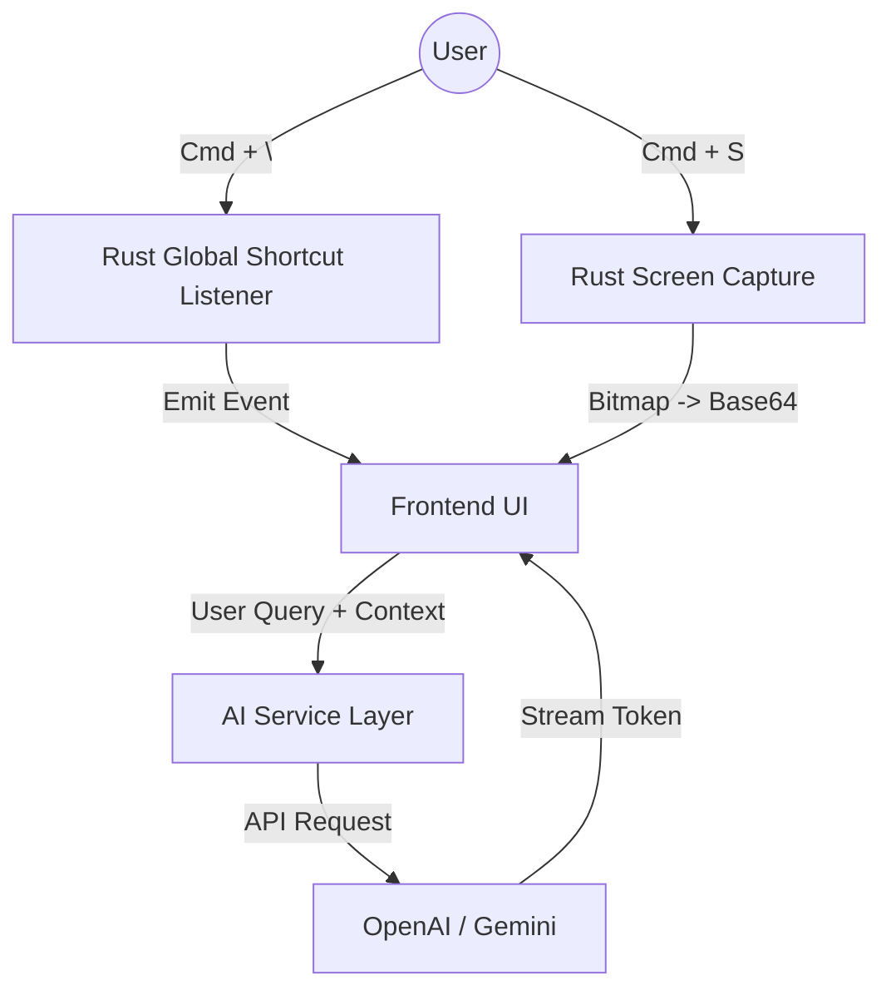

# Lens - Context-Aware AI Assistant

> **A native, lightweight desktop assistant that integrates AI directly into your workflow without context switching.**


---

## 🎯 Project Purpose

In the modern developer workflow, switching between an IDE and a browser for AI assistance breaks flow and context. **Lens** solves this by acting as an intelligent, ephemeral overlay that "sees" what you see.

The goal was to build a tool that feels **native, instant, and invisible** until needed. It leverages recent advancements in multimodal AI (Gemini 2.5, GPT-5) to analyze screen content in real-time, allowing users to ask questions like *"What is this error?"* or *"Explain this graph"* without manual copy-pasting.

## 🚀 Key Technical Highlights

This project demonstrates proficiency in **systems programming, frontend engineering, and AI integration**.

### 1. Native Desktop Integration (Rust + Tauri)
- **Global Hotkeys**: Implemented low-level global shortcut listeners to toggle the app instantly (`Cmd + \`), independent of application focus.
- **Window Management**:
  - **macOS**: Utilizes `cocoa` crate to access `NSApplication` and `NSWindow` APIs directly, setting the app as an "Accessory" (hiding dock icon) and configuring collection behavior to ensure it floats above full-screen apps.
  - **Windows**: Configures strictly typed window styles for seamless overlay behavior.
- **Privacy-First Screen Capture**: Unlike Electron apps that might rely on heavier dependencies, Lens uses efficient Rust implementations for screen capture, ensuring low latency. It also implements **Content Protection** APIs to prevent the AI window itself from appearing in screenshots or screen shares.

### 2. Robust AI Abstraction Layer
- Designed a scalable **Provider Pattern** in TypeScript (`src/ai.ts`) that decouples the UI from specific AI vendors.
- Currently supports **OpenAI** and **Google Gemini**, with normalized data structures for messages, attachments, and streaming responses.
- Handles **Multimodal Context** ("Vision") by efficiently processing and formatting base64 image data from the Rust backend for API consumption.

### 3. Modern React 19 Frontend
- Built with **React 19** and **Vite 7** for a performant, concurrent UI.
- **Component Architecture**: Features a modular design with a focus on accessibility and keyboard navigation.
- **Rich Content Rendering**: Custom implementation of Markdown rendering with syntax highlighting and MathJax support, ensuring code and formulas are readable.

## 🛠️ Technology Stack & Rationale

| Layer | Technology | Rationale |
|-------|------------|-----------|
| **Core Core** | **Tauri 2 (Rust)** | Chosen over Electron for its **<10MB binary size** and drastically lower RAM usage. Rust ensures memory safety and concurrency for global event listeners. |
| **Frontend** | **React 19 + TypeScript** | Provides type safety and leverages the latest React features (Actions, optimizing compilers) for a snappy UI. |
| **Build Tool** | **Vite** | Instant HMR (Hot Module Replacement) and optimized production builds. |
| **AI Integration** | **OpenAI & Google GenAI SDKs** | Direct integration ensures access to the latest models (GPT-4o, Gemini 1.5 Pro) with full control over system prompts and temperature. |
| **State** | **React Hooks** | Simple, efficient local state management suitable for an ephemeral overlay tool. |

## 🏗️ Architecture Design

The application follows a **Message-Passing Architecture** between the system (Rust) and the UI (Webview).



## ⚠️ Challenges & Trade-offs

### Challenge: Cross-Platform Overlay Behavior
**Problem**: Creating a window that stays on top of full-screen applications on macOS is notoriously difficult due to OS restrictions.
**Solution**: I dropped down to unsafe Rust code using the `cocoa` bindings to manipulate `NSWindowCollectionBehavior`. This allows the window to join all spaces, effectively floating over everything, including full-screen IDEs.

### Challenge: Screenshot Latency
**Problem**: Sending full-resolution screenshots to the AI API can be slow and consume high bandwidth.
**Solution**: Implemented an optimization pipeline where screenshots are captured natively in Rust, resized/compressed if necessary, and then passed to the frontend only when requested by the user.

### Trade-off: Local vs. Cloud AI
**Decision**: Currently relies on Cloud APIs (OpenAI/Google).
**Reason**: While local LLMs (Llama 3) offer privacy, they are too heavy for many consumer laptops. The priority was *instant* feedback, which currently necessitates the speed of cloud inference models like Gemini Flash.

## 🏃‍♂️ How to Run

### Prerequisites
- **Node.js**: v20+
- **Rust**: Latest stable (`rustup update`)
- **API Keys**: OpenAI or Google Gemini (configured in `.env` or Settings)

### Installation
1. **Clone & Install**
   ```bash
   git clone https://github.com/saif/lens-app.git
   cd lens-app
   npm ci
   ```

2. **Setup Env** (Optional, can also set in UI)
   ```bash
   cp .env.example .env
   # Add your keys: VITE_OPENAI_API_KEY=...
   ```

3. **Develop**
   ```bash
   # Runs the Tauri dev window + Vite server
   npm run tauri dev
   ```

4. **Build**
   ```bash
   npm run tauri build
   ```

---
